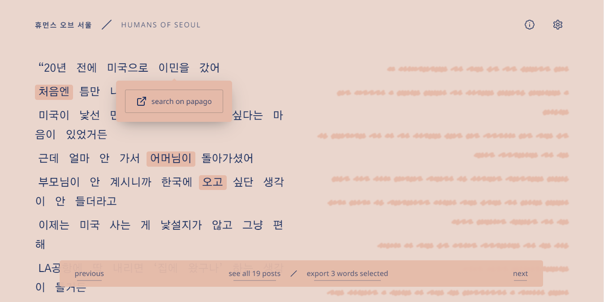
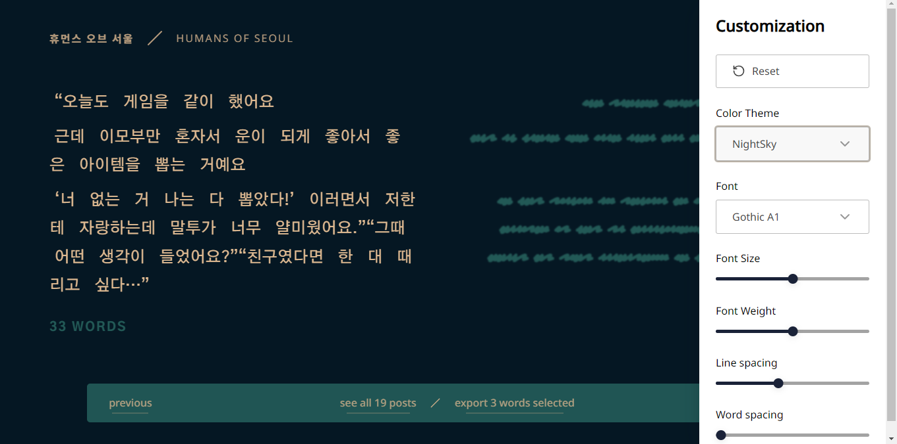
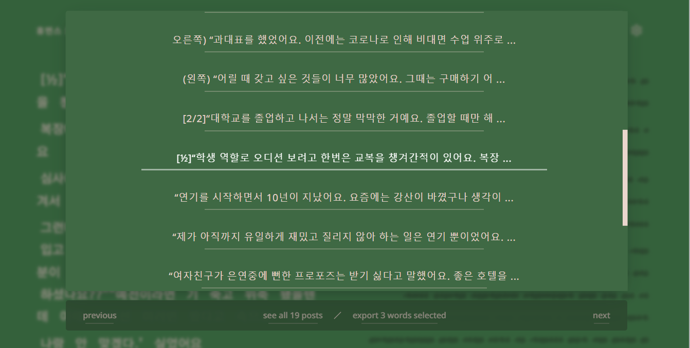

# Humans of Seoul / Formatted RSS Feed
Formatting Humans of Seoul RSS feed to be to practice reading in koreand and be able to read only the korean text and open translation when/if wanted.


> ### Access app on the link:
> https://esteves-esta.github.io/humans-of-seoul-feed-format/
> 
---
## Index

# Table of Contents
- [Humans of Seoul / Formatted RSS Feed](#humans-of-seoul--formatted-rss-feed)
  - [Index](#index)
- [Table of Contents](#table-of-contents)
  - [Printscreen](#printscreen)
  - [📖 Features](#-features)
    - [✅ Done ✨✨](#-done-)
  - [🧰 Tech Stack](#-tech-stack)
  - [🚀 How to run locally](#-how-to-run-locally)
- [Learning sources](#learning-sources)

---
---

## Printscreen






---
## 📖 Features
### ✅ Done ✨✨

- [x] Consume RSS Fedd
  - [x] Parse XML to DOM
  - [x] DOM to JSON
- [x] Show 1 post at a time
- [x] Post features
  - [x] Hide translation
  - [x] Toggle translation by paragraph
  - [x] Select word from the korean original
  - [x] Show count of words in total
  - [x] Popover with button opening papago page on word
  - [x] Export X words selected
- [X] Be able to go to previous or next post
- [x] Settings for customization
  - [x] Change font family
  - [x] Change font weight
  - [x] Change background and font color
  - [x] Change word spacing
  - [x] Change paragraph margin
- [x] Show list of posts 
- [x] Style / Follow the prototype
- [x] responsive - mobile

---

## 🧰 Tech Stack

- Vite
- React
- Typescript
- SWR
- Lucide React - icons
- Papaparse - json to csv
- Radix-UI - unstyled components

---

## 🚀 How to run locally

1. Install packages

      ```
      npm i 
      ```
      
      or

      ```
      yarn i
      ```

2. Run api proxy

      ```
      npm run proxy 
      ```
      
      or

      ```
      yarn proxy
      ```


3. Run dev server

      ```
      npm run dev 
      ```
      
      or

      ```
      yarn dev
      ```


# Learning sources

- [Parsing and serializing XML
](https://developer.mozilla.org/en-US/docs/Web/XML/Parsing_and_serializing_XML)
- [How to Fetch and Parse RSS Feeds in JavaScript](https://css-tricks.com/how-to-fetch-and-parse-rss-feeds-in-javascript/)
- [Create an RSS Reader with React and JavaScript](https://thewebdev.info/2021/02/13/create-an-rss-reader-with-react-and-javascript/)


